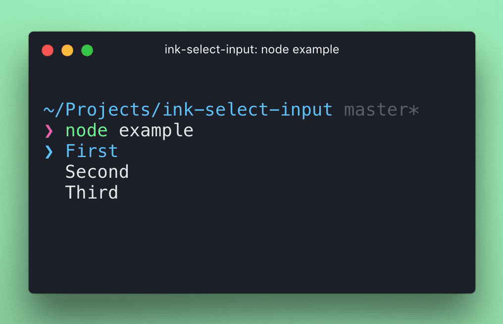

# ink-select-input [](https://github.com/vadimdemedes/ink-select-input/actions)

> Select input component for [Ink](https://github.com/vadimdemedes/ink)

Looking for a version compatible with Ink 2.x? Check out [this release](https://github.com/vadimdemedes/ink-text-input/tree/v3.1.2).

## Install

```
$ npm install ink-select-input
```

## Usage

```jsx
import React from 'react';
import {render} from 'ink';
import SelectInput from 'ink-select-input';

const Demo = () => {
	const handleSelect = item => {
		// `item` = { label: 'First', value: 'first' }
	};

	const items = [
		{
			label: 'First',
			value: 'first'
		},
		{
			label: 'Second',
			value: 'second'
		},
		{
			label: 'Third',
			value: 'third'
		}
	];

	return <SelectInput items={items} onSelect={handleSelect} />;
};

render(<Demo />);
```



## Props

### items

Type: `array`<br>
Default: `[]`

Items to display in a list. Each item must be an object and have `label` and `value` props, it may also optionally have a `key` prop.
If no `key` prop is provided, `value` will be used as the item key.

### isFocused

Type: `boolean`<br>
Default: `true`

Listen to user's input. Useful in case there are multiple input components at the same time and input must be "routed" to a specific component.

### initialIndex

Type: `number`
Default: `0`

Index of initially-selected item in `items` array.

### limit

Type: `number`

Number of items to display.

### indicatorComponent

Type: `Component`

Custom component to override the default indicator component.

### itemComponent

Type: `Component`

Custom component to override the default item component.

### onSelect

Type: `function`

Function to call when user selects an item. Item object is passed to that function as an argument.

### onHighlight

Type: `function`

Function to call when user highlights an item. Item object is passed to that function as an argument.
